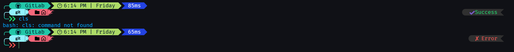

# ⚡ HackerShell – A Clean & Powerful Oh My Posh Theme

**HackerShell** is a modern, information-rich yet clean **oh-my-posh theme** designed for developers who want clarity without clutter.

It is especially suited for:
- Data Engineers
- Backend / Cloud Developers
- Git-heavy workflows
- VS Code integrated terminals

The theme is **fully dynamic** — it only shows what you are actively using.

---

## ✨ Features

- 🖥️ OS & shell detection
- ⚙️ CPU & RAM usage
- ⏱️ Command execution time
- 📅 Time & date
- 🌱 Git branch, status, stash, ahead/behind
- 🐳 Docker context & version (when available)
- 🐍 Python virtual environment & version
- ☁️ AWS & Azure context
- 🎵 Spotify now playing
- ✅ Command success / ❌ error indicator
- Clean powerline/diamond styling
- Works across **PowerShell, Git Bash, Ubuntu / WSL**

---

## 📸 Preview

---

## 📦 Requirements

- **Oh My Posh v20+**
- A Nerd Font (required for icons)

### Recommended Fonts
- `JetBrainsMono Nerd Font`
- `CaskaydiaCove Nerd Font`
- `FiraCode Nerd Font`

---

## 🚀 Installation

### 1️⃣ Install Oh My Posh

#### Windows (PowerShell)
`winget install JanDeDobbeleer.OhMyPosh`

#### MacOS
`brew install oh-my-posh`

#### Linux
`sudo apt install oh-my-posh`

---

### 2️⃣ Nerd Font
https://www.nerdfonts.com/

---

### 3️⃣ Download the Theme
`git clone https://github.com/prince-pastakiya/oh-my-posh-themes.git`

---

## ⚙️ Activate the Theme

#### Windows Powershell

 - `notepad $PROFILE`
 - Add at the very bottom: `oh-my-posh init pwsh --config "$HOME\.poshthemes\hackershell.omp.json" | Invoke-Expression`
 - Reload Terminal: `. $PROFILE`

#### Git Bash/Zsh

 - Check for profile: `~/.bashrc`
 - Edit Profile: `nano ~/.bashrc`
 - Add at the end of the file: `eval "$(oh-my-posh.exe init bash --config ~/.poshthemes/GitLab.omp.json)"`
 - To Save Setting: `CTRL+O` `Enter` `CTRL+X`
 - Restart GitBash

#### Kali/Ubuntu Linux WSL

 - Check for profile: `~/.bashrc`
 - Edit Profile: `nano ~/.bashrc`
 - Add at the end of the file: `eval "$(oh-my-posh.exe init bash --config ~/.poshthemes/hackershell.omp.json)"`
 - To Save Setting: `CTRL+O` `Enter` `CTRL+X`
 - Reload: `source ~/.bashrc`
 - Restart GitBash

---

## 🛠 Customization

### You are encouraged to fork and tweak:

 - Colors
 - Icons
 - Segment order
 - Visibility rules

#### Oh My Posh Docs:
👉 https://ohmyposh.dev/docs/

---

## ⭐ Support

If you like this theme:

 - ⭐ Star the repo
 - Share it with fellow devs
 - Customize and show it off 🚀
